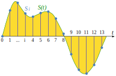
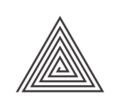
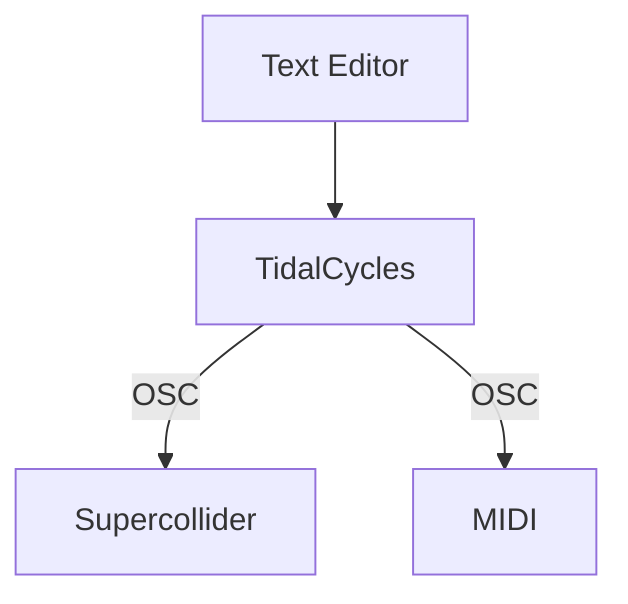

# Livecoding for Audiovisuals

Carl Colglazier

April 5/6, 2022

---

## About the instructor (Carl Colglazier)

Background

+ Second-year PhD student in Technology and Social Behavior (Northwestern)
+ B.S. Computer Science, B.A. Communication--Media (NC State)
+ Research online communities with the Community Data Science Collective
+ Extremely rusty documentary filmmaker
+ Really into modular synthesizers


---
layout: section
---

# Computer Music, DSP, and why audio went digital

---
layout: image-left
image: ./images/cmj.jpeg
---

## Computer music

A term used to mean many things, including the use of computing for

+ composition
+ sound synthesis[^1]

Different from similar techniques in that it uses **digital** tools.

[^1]: Manning, Peter. *Electronic and computer music*. Oxford University Press, 2013.

---
layout: fact
---

## **Claim**: digital signal processing can reproduce *any* sound.

---

## All sounds are sine waves (Fourier series)


Example: square waves.


Square waves can be represented as the sum of the odd harmonic sine waves:

$$
\begin{aligned}
x(t)&={\frac {4}{\pi }}\sum _{k=1}^{\infty }{\frac {\sin \left(2\pi (2k-1)ft\right)}{2k-1}}\\&={\frac {4}{\pi }}\left(\sin(\omega t)+{\frac {1}{3}}\sin(3\omega t)+{\frac {1}{5}}\sin(5\omega t)+\ldots \right),&{\text{where }}\omega =2\pi f.
\end{aligned}
$$


---

### Digital audio can reproduce any sound up to the Nyquist frequency




  - Common misconception: digital audio is discrete. Actually: the samples represent points on a curve and a function that fits those points.
  - Brute force: just create random samples over time $t$. Most of the results will be white noise.


<style>
  img {
    width: 500px;
    float: left;
    padding-right: 5rem;
  }
</style>

---

## The problem with performing computer music live

Back in the day: computing power

+ Put your code on a punch card and wait a couple of days.
+ Computers used either to produce tape music or just data for performance with live instruments.

Today: are you just pressing buttons?

+ Expressive interfaces for digital instruments is an ongoing research area.
+ People have very strong ideas about laptops on stage.


---
layout: fact
---

# What is livecoding?

Livecoding is a performance where code is written, compiled and run in a real-time environment.

<!--

-->

---
layout: center
---

## Pulling back the curtain

What tools did I use in my intro performance?




---
layout: fact
---

# Why do people do this?


---
layout: quote
---

TOPLAP Manifesto (Draft, 2004)

> We demand:
> + Give us access to the performer's mind, to the whole human instrument.
> + Obscurantism is dangerous. Show us your screens.
> + Programs are instruments that can change themselves
> + The program is to be transcended - Artificial language is the way.
> + Code should be seen as well as heard, underlying algorithms viewed as well as their visual outcome.
> + Live coding is not about tools. Algorithms are thoughts. Chainsaws are tools. That's why algorithms are sometimes harder to notice than chainsaws.
> 
> We recognise continuums of interaction and profundity, but prefer:
> + Insight into algorithms
 > + The skillful extemporisation of algorithm as an expressive/impressive display of mental dexterity
> + No backup (minidisc, DVD, safety net computer)
>
> We acknowledge that:
> + It is not necessary for a lay audience to understand the code to appreciate it, much as it is not necessary to know how to play guitar in order to appreciate watching a guitar performance.
> + Live coding may be accompanied by an impressive display of manual dexterity and the glorification of the typing interface.
> + Performance involves continuums of interaction, covering perhaps the scope of controls with respect to the parameter space of the artwork, or gestural content, particularly directness of expressive detail. Whilst the traditional haptic rate timing deviations of expressivity in instrumental music are not approximated in code, why repeat the past? No doubt the writing of code and expression of thought will develop its own nuances and customs.

<style>
  blockquote {
    font-size: 0.75rem!important;
  }
</style>

<!---
  Keep this slide up in the background while doing something else.
  -->

---
layout: fact
---

Should code remain hidden in the background...

...or placed in the foreground?


---

## Livecoding in pop culture

Charli XCX -- Track 10

<iframe width="560" height="315" src="https://www.youtube-nocookie.com/embed/Rj6dwEBmBJA" title="YouTube video player" frameborder="0" allow="accelerometer; autoplay; clipboard-write; encrypted-media; gyroscope; picture-in-picture" allowfullscreen></iframe>

---

# Computers and digital arts

Algorists

```
if (creation && object of art && algorithm && one's own algorithm) {
     return * an algorist *
} else {
     return * not an algorist *
}
```


---
layout: iframe
url: https://hydra.ojack.xyz/?sketch_id=malitzin_1
---

---
layout: iframe
url: https://editor.p5js.org/
---
