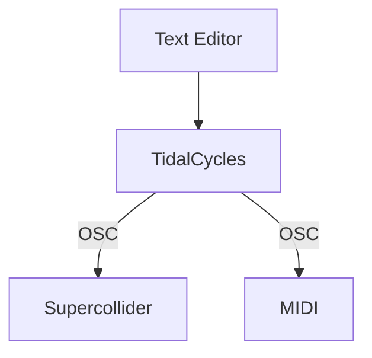

# Livecoding for Audiovisuals

Carl Colglazier

April 5-6, 2022

---

## About the instructor (Carl Colglazier)

Background

+ Second-year PhD in Technology and Social Behavior (Northwestern)
+ B.S. Computer Science, B.A. Communication--Media (NC State)
+ Really into modular synthesizers

---
layout: image-left
image: ./images/cmj.jpeg
---

## Computer music

(image of computer music journal)

(image of xenacis or similar)

---

## The problem with performing computer music live

Are you just pressing buttons?

---

## What is livecoding?

**Livecoding** is...

---

Should code remain hidden in the background...

...or placed in the foreground?

---
layout: center
---
## Pulling back the curtain

---

## Why do people do this?

### Education

+ Sonic Pi

---
layout: quote
---

TOPLAP Manifesto (Draft, 2004)

> We demand:
> + Give us access to the performer's mind, to the whole human instrument.
> + Obscurantism is dangerous. Show us your screens.
> + Programs are instruments that can change themselves
> + The program is to be transcended - Artificial language is the way.
> + Code should be seen as well as heard, underlying algorithms viewed as well as their visual outcome.
> + Live coding is not about tools. Algorithms are thoughts. Chainsaws are tools. That's why algorithms are sometimes harder to notice than chainsaws.
> 
> We recognise continuums of interaction and profundity, but prefer:
> + Insight into algorithms
 > + The skillful extemporisation of algorithm as an expressive/impressive display of mental dexterity
> + No backup (minidisc, DVD, safety net computer)
>
> We acknowledge that:
> + It is not necessary for a lay audience to understand the code to appreciate it, much as it is not necessary to know how to play guitar in order to appreciate watching a guitar performance.
> + Live coding may be accompanied by an impressive display of manual dexterity and the glorification of the typing interface.
> + Performance involves continuums of interaction, covering perhaps the scope of controls with respect to the parameter space of the artwork, or gestural content, particularly directness of expressive detail. Whilst the traditional haptic rate timing deviations of expressivity in instrumental music are not approximated in code, why repeat the past? No doubt the writing of code and expression of thought will develop its own nuances and customs.

<!---
  Keep this slide up in the background while doing something else.
  -->

---

## Livecoding in pop culture

Charli XCX -- Track 10

<iframe width="560" height="315" src="https://www.youtube-nocookie.com/embed/Rj6dwEBmBJA" title="YouTube video player" frameborder="0" allow="accelerometer; autoplay; clipboard-write; encrypted-media; gyroscope; picture-in-picture" allowfullscreen></iframe>

---

## Some other livecoding tools

